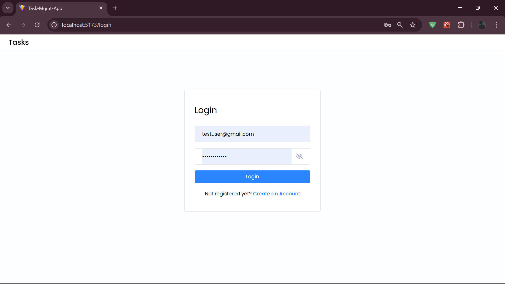
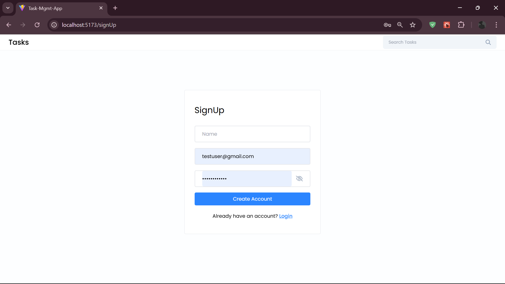
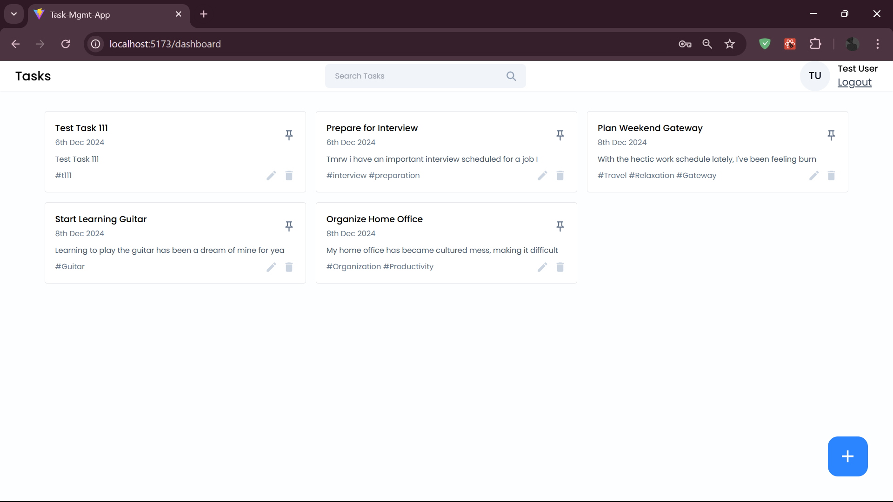
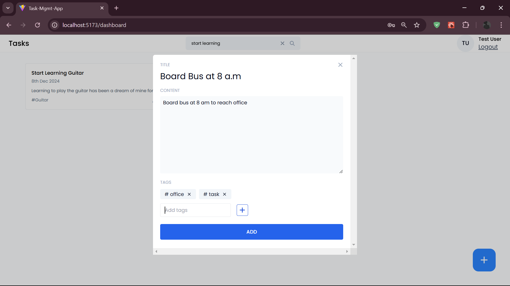
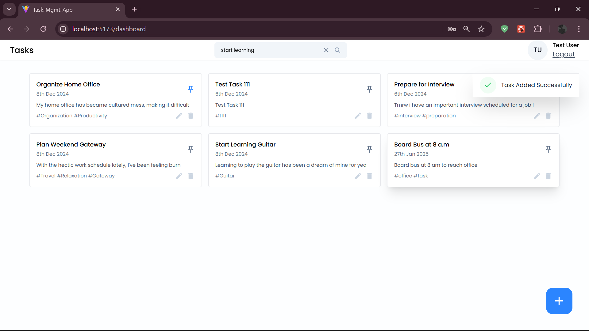
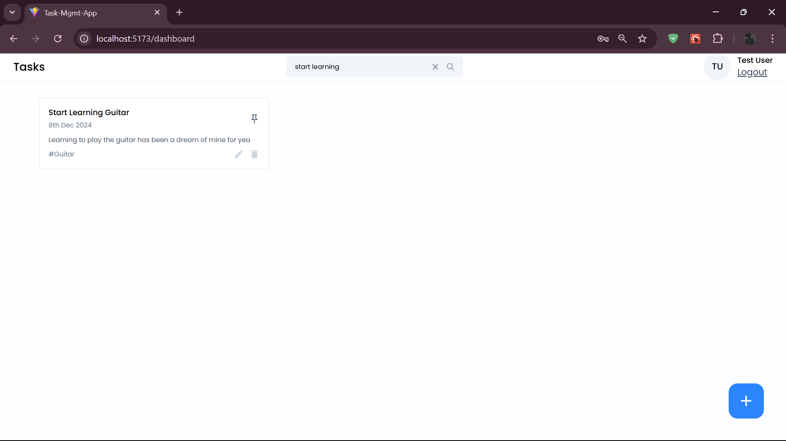
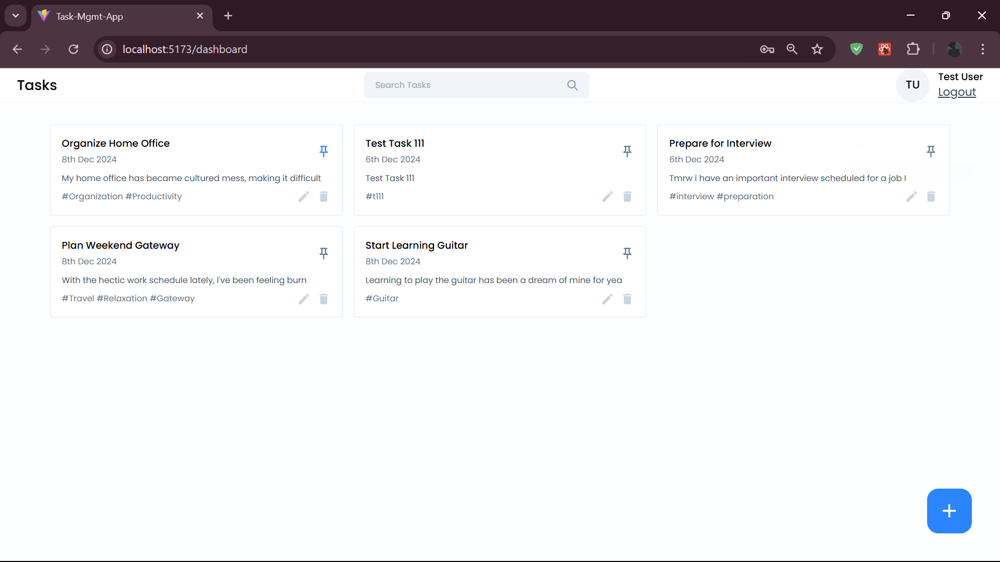
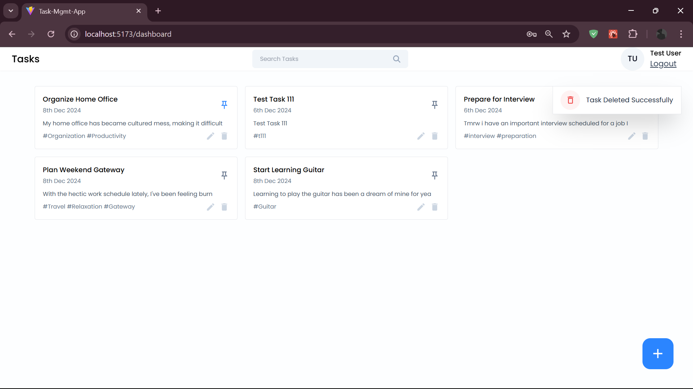

# Task Management Application

A modern task management application built with the MERN stack (MongoDB, Express.js, React.js, Node.js) and styled with Tailwind CSS. This application helps users organize and track their tasks with a clean and intuitive interface.

## 🌟 Features

- **User Authentication**
  - Secure login and registration system
  - Email-based authentication
  - Password protection with visibility toggle
  - Account creation for new users

- **Task Management**
  - Create, read, update, and delete tasks
  - Add task titles and detailed descriptions
  - Set task dates and deadlines
  - Tag-based task categorization
  - Task search functionality
  - Success notifications for task operations

- **Task Organization**
  - Custom tagging system with hashtags
  - Task filtering and searching
  - Clean and intuitive dashboard interface
  - Task date tracking and sorting

- **User Interface**
  - Responsive design for all devices
  - Modern and clean UI with Tailwind CSS
  - User-friendly dashboard
  - Search functionality with real-time filtering
  - Interactive task cards
  - Success notifications and alerts

## 🚀 Technology Stack

- **Frontend**
  - React.js
  - Tailwind CSS for styling
  - React Router for navigation
  - Context API for state management

- **Backend**
  - Node.js
  - Express.js
  - MongoDB for database
  - JWT for authentication

## 💻 Installation

1. Clone the repository
```bash
git clone https://github.com/d33pak-gm/TASK-APP.git
```

2. Install dependencies for backend
```bash
cd TASK-APP/backend
npm install
```

3. Install dependencies for frontend
```bash
cd ../frontend/task-app
npm install
```

4. Create a .env file in the backend directory with the following variables:
```env
MONGODB_URI=your_mongodb_connection_string
JWT_SECRET=your_jwt_secret
PORT=5173
```

5. Start the backend server
```bash
cd TASK-APP/backend
npm run start
```

6. Start the frontend development server
```bash
cd TASK-APP/frontend/task-app
npm run dev
```

## 🔧 Configuration

### Environment Variables

Create a `.env` file in the backend directory with the following configurations:

```env
MONGODB_URI=your_mongodb_connection_string
JWT_SECRET=your_jwt_secret
PORT=5173
```

## 🌐 API Endpoints

### Authentication
- `POST /api/auth/register` - Register a new user
- `POST /api/auth/login` - Login user

### Tasks
- `GET /api/tasks` - Get all tasks
- `POST /api/tasks` - Create a new task
- `PUT /api/tasks/:id` - Update a task
- `DELETE /api/tasks/:id` - Delete a task

## 🎨 Features in Detail

### Task Management
- Create tasks with title and description
- Add multiple tags to categorize tasks
- Set task dates
- Search through tasks
- Edit and delete tasks
- Task completion tracking

### User Interface
- Clean and minimal design
- Responsive layout
- Interactive task cards
- Easy-to-use dashboard
- Search functionality
- Tag-based filtering

## 🤝 Contributing

1. Fork the repository
2. Create your feature branch (`git checkout -b feature/AmazingFeature`)
3. Commit your changes (`git commit -m 'Add some AmazingFeature'`)
4. Push to the branch (`git push origin feature/AmazingFeature`)
5. Open a Pull Request

## 📝 License

This project is licensed under the MIT License - see the LICENSE.md file for details

## 👥 Authors

- Deepak - Initial work - [d33pak-gm](https://github.com/d33pak-gm)

## 🙏 Acknowledgments

- Tailwind CSS for the amazing styling utilities
- MongoDB for the robust database
- React.js community for the excellent frontend framework
- Node.js community for the backend runtime

## 📸 Screenshots

### Authentication

*Secure login interface with email and password*


*New user registration page with account creation form*

### Dashboard

*Main dashboard showing all tasks and organization features*

### Task Operations

*Create new tasks with title, description, and tags*


*Success notification after adding a new task*

### Task Management

*Search functionality to filter and find specific tasks*


*Pin important tasks for quick access*


*Task deletion with confirmation*


*Success notification after task deletion*
